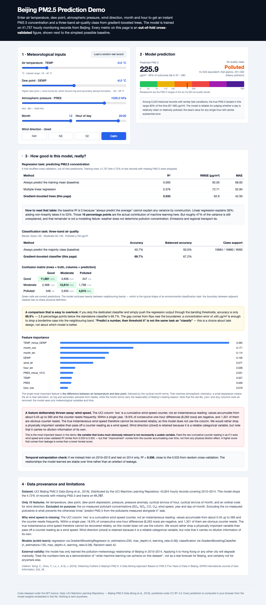

# Beijing PM2.5 Prediction Demo (Environmental ML Teaching Demo)

**Live demo (GitHub Pages): https://drhycheung.github.io/EnvML/**



A single-file, front-end-only interactive demo that predicts **PM2.5 concentration**
and a three-band air-quality class from meteorological inputs, using gradient-boosted
trees that run entirely in the browser. Built for classroom demonstration in
**Environmental Informatics**, **Environmental ML** and **Smart City** courses.

File: `index.html` — no build step, no backend, no API key, **no network requests at
all**. Double-click it from disk and it works, offline. Drop it into a GitHub Pages
repository and it is deployed.

**Why this exists.** Environmental data is abundant and dashboards to display it are easy,
but a chart can only ever describe what has already happened. Someone asking *"will
tomorrow evening exceed 150 µg/m³ — do we issue a health advisory, move the sports lesson
indoors, switch on the heaters?"* cannot be helped by any amount of history. Data without
prediction produces description, not decisions. This page takes the same data stream and
turns it into a forward-looking estimate the user can act on, with the uncertainty
attached so they know how far to trust it.

A prediction nobody trusts is as useless as no prediction at all, so the page also shows
its own evaluation against trivial baselines, and openly explains the one feature it had
to throw away.

---

## 1. From data to decision

The whole project is one distinction, and it is worth stating before the feature list:

| Question | Answered by | Not answered by |
|---|---|---|
| "What has the pollution been?" | A dashboard, a chart, a time series | — |
| "Will it exceed 150 µg/m³ tomorrow evening?" | — | A dashboard |
| "Should we issue an advisory?" | **A prediction, shown against the threshold that triggers it** | — |
| "How much should I believe it?" | Baselines, an empirical interval, and a stated leak | — |

The prediction therefore occupies the prime position on the page, in the largest type,
with the AQI scale showing where the estimate lands against the 50 and 150 µg/m³
thresholds — because those thresholds *are* the decision the user is trying to make. The
charts are supporting evidence, not the headline.

A user must be able to set tomorrow's conditions and get a prediction. A tool that can
only replay historical rows has quietly become a dashboard; that distinction is the
teaching point.

## 2. What the page does

| Feature | Implementation |
|---|---|
| **Predict PM2.5 from 5 sliders + wind direction** | The headline output, centre of the page. Gradient-boosted trees serialised to flat arrays; traversal in ~15 lines of vanilla JS |
| **Actionable class against a threshold** | Second ensemble (450 trees) gives Good / Moderate / Polluted, with a marker on the AQI scale at 50 and 150 µg/m³ |
| Evaluate any future hour | Sliders accept any month, hour and conditions, so "tomorrow evening" is a supported question |
| Predict a three-band air quality class | Shown alongside the concentration |
| No ML library in the browser | scikit-learn's fitted trees exported as `[feature, threshold, left, right, value]` at stride 5 |
| Honest evaluation panel | Out-of-fold 5-fold CV metrics, with a predict-the-mean baseline and a linear-regression baseline beside the model |
| Prediction interval | Empirical 10th–90th percentile of out-of-fold residuals, bucketed by predicted level |
| Leakage demonstration | The page states that the dropped wind-speed feature *raises* R² from 0.533 to 0.555, and why that is bad news |
| Task-design comparison | Accuracy of direct classification vs. thresholding the regression output |
| Feature importance | Table with bars, plus a plain-language reading of why dew-point depression dominates |
| "Load a random real record" | 60 held-out rows; shows the model's prediction next to the measured value and the error |
| Slider bounds from the data | Every slider range is read from the model file, so it can never be narrower than the training data |
| Zero dependencies | All CSS vendored inline, no CDN, no web fonts, no `fetch()` |

> **New to machine learning?** [Model notes §1](docs/model-notes.md#1-the-algorithms-in-plain-language)
> explains baselines, linear regression, decision trees, gradient boosting,
> cross-validation and the leak, from first principles — and traces a real prediction
> through the exported trees, step by step.

## 3. Data, and the one feature that had to go

Source: [UCI Beijing PM2.5 Data](https://archive.ics.uci.edu/dataset/381/beijing+pm2+5+data)
(Song et al., 2016), 43,824 hourly rows for Beijing 2010–2014. The 4.72% with a missing
PM2.5 value are dropped, leaving **41,757** rows.

<details>
<summary><strong>Download the data</strong> (if you do not have it — a copy is already committed at <code>data/beijing_pm25.csv</code>)</summary>

```bash
mkdir -p data && curl -L -o /tmp/pm25.zip \
  "https://archive.ics.uci.edu/static/public/381/beijing+pm2+5+data.zip"
unzip -o /tmp/pm25.zip -d data          # yields PRSA_data_2010.1.1-2014.12.31.csv
mv data/PRSA_data_2010.1.1-2014.12.31.csv data/beijing_pm25.csv
```

Verify before you use it:

```bash
wc -l data/beijing_pm25.csv     # must be 43,825  (43,824 rows + header)
head -1 data/beijing_pm25.csv   # No,year,month,day,hour,pm2.5,DEWP,TEMP,PRES,cbwd,Iws,Is,Ir
```

Two gotchas: the legacy UCI path
`.../ml/machine-learning-databases/00381/BeijingPM2.5.data` now returns **404** because UCI
restructured its archive — use the `static/public` URL above. And the column is literally
named `pm2.5`, whose dot breaks attribute access in some libraries; rename it to `pm25`
on load. The committed copy is byte-identical to a fresh download.

</details>

Ten features: air temperature, dew point, dew-point depression, pressure, pressure
anomaly, cyclical sin/cos of hour, cyclical sin/cos of month, and wind direction as an
ordinal code.

**Wind speed is missing, and that is the most important thing on the page.** The UCI
column `Iws` is a *cumulative counter*, not an instantaneous reading: it climbs from
about 0.45 to 585, and within a single year 18.9% of its consecutive one-hour
differences are negative (1,301 of them obvious counter resets), while naive differencing
produces physically impossible values like −489 m/s.

Using the raw counter anyway raises cross-validated R² from 0.533 to **0.555**. That
"improvement" is time leaking through an accumulator, not physics. A higher score
bought with leakage is worse than a lower honest score, so the feature is dropped and
the page says so out loud. Both figures are recomputed on every training run — see the
[full dataset card](docs/dataset.md).

## 4. Results

All out-of-fold, 5-fold shuffled cross-validation, seed 42.

**Regression — PM2.5 concentration**

| Method | R² | RMSE (µg/m³) | MAE |
|---|---|---|---|
| Always predict the training mean | −0.000 | 92.05 | 68.83 |
| Multiple linear regression | 0.376 | 72.71 | 52.84 |
| **Gradient-boosted trees (the page)** | **0.533** | 62.90 | 42.93 |

Non-linearity is worth 16 percentage points of R² over linear regression. The
remaining ~47% of the variance is not a modelling failure: weather does not determine
pollution, emissions and regional transport do.

**Classification — three-band air quality** (Good <50 · Moderate 50–150 · Polluted ≥150 µg/m³)

| Method | Accuracy | Balanced accuracy |
|---|---|---|
| Always predict the majority class | 40.66% | 50.0% |
| **Gradient-boosted classifier (the page)** | **69.70%** | 67.22% |
| Bands derived by thresholding the regression output | 66.90% | — |

That last row is a design lesson, not a model ranking: a concentration error of ±60 µg/m³
flips borderline cases, so "predict a number then threshold it" and "classify" are
different tasks with different error budgets.

Two robustness checks: training on ≤2013 and testing on 2014 gives R² = 0.556 (close to
the CV figure, so the relationships are stable in time rather than an artefact), and
the full confusion matrix is printed on the page.

## 5. How to run

- **Students, teachers, anyone**: double-click `index.html`. It needs nothing else —
  no server, no network, no installation. This is the intended way to use it.
- **Locally with a server** (only if you want to edit): `python3 -m http.server 8000`,
  then visit `http://localhost:8000/index.html`. Functionally identical.
- **GitHub Pages (your own deployment)**: push `index.html` to *your* repository, then
  enable Pages via **Settings → Pages → Deploy from a branch** (branch + `/ (root)`).
  Yours will live at `https://<your-username>.github.io/<repo-name>/`. The link at the
  top of this README is the author's own deployment.

### Rebuilding from source

`index.html` is generated. Edit the sources, not the output.

```bash
python3 scripts/train_model.py    # retrain -> model/model.json   (~60 s)
python3 scripts/build_page.py     # inline model + CSS -> index.html
python3 scripts/verify_page.py    # prove the page still agrees with Python
```

`verify_page.py` runs 26 checks and exits non-zero on failure. See the
[model notes](docs/model-notes.md) for what each one covers and why it exists.

## 6. Known limitations

Several of these are consequences of the constraints in §3 rather than oversights:

| Limitation | Consequence |
|---|---|
| Trained **only** on Beijing 2010–2014 | Applying it to Hong Kong or anywhere else degrades markedly. It is a demonstration of method, not a forecast |
| **No wind speed**, the obvious missing predictor | Materially caps achievable accuracy; §3 explains why |
| Weather inputs only — no emissions inventory | The unexplained ~47% of variance is structural, not fixable by a better learner |
| Single-city, single-period training set | No claim of generalisation across cities, seasons or instrument types |
| Class bands are hard thresholds at 50 / 150 µg/m³ | Adjacent bands have no sharp physical boundary, which is why the confusion matrix is full of near-misses |
| Prediction interval is empirical, not probabilistic | It reports where the truth *usually* landed for similar conditions, not a calibrated 80% credible interval |
| Leaf values rounded when exporting | Regression self-check absorbs this (max deviation 0.0007 µg/m³), but the browser is not bit-identical to a live sklearn model |
| `src/app.css` is a vendored snapshot | Adding a new utility class without regenerating it yields an unstyled element — `verify_page.py` fails the build to stop this |
| Desktop-first layout | Tested at 390 px and 1280 px with no horizontal overflow, but not a full mobile design |

## 7. Documentation

| Document | What it covers |
|---|---|
| **[Vibe-coding guide](docs/vibe-coding.md)** | The design-thinking rationale (data without prediction cannot drive action), how the page was actually built with an AI coding tool, the bugs that measurement caught and looking did not, and the complete copy-paste prompt — including how to download the dataset — to reproduce it |
| **[Model notes](docs/model-notes.md)** | **The algorithms taught from scratch** (baseline, linear regression, decision trees, gradient boosting, cross-validation, the leak), then tree serialisation, the verification harness, the vendored-CSS trade-off, and how to add a feature safely |
| **[Dataset card](docs/dataset.md)** | Provenance, every column and why it is or is not used, and the `Iws` data-quality investigation in full |

## 8. Licences & attribution

- **Code**: MIT — see [LICENSE](LICENSE), © 2026 drhycheung.
- **Data**: [Beijing PM2.5 Data](https://archive.ics.uci.edu/dataset/381/beijing+pm2+5+data)
  (Song et al., 2016), CC BY 4.0, courtesy of the UCI Machine Learning Repository.
  Copyright remains with UCI and the original authors.

The two are separately licensed: the MIT licence covers this repository's code only and
does not extend to the dataset.